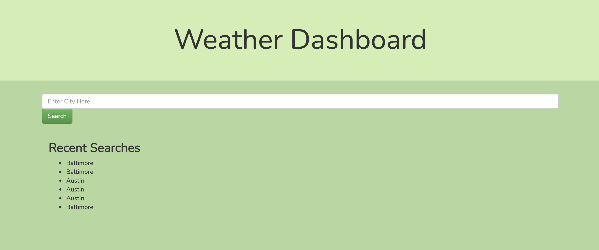
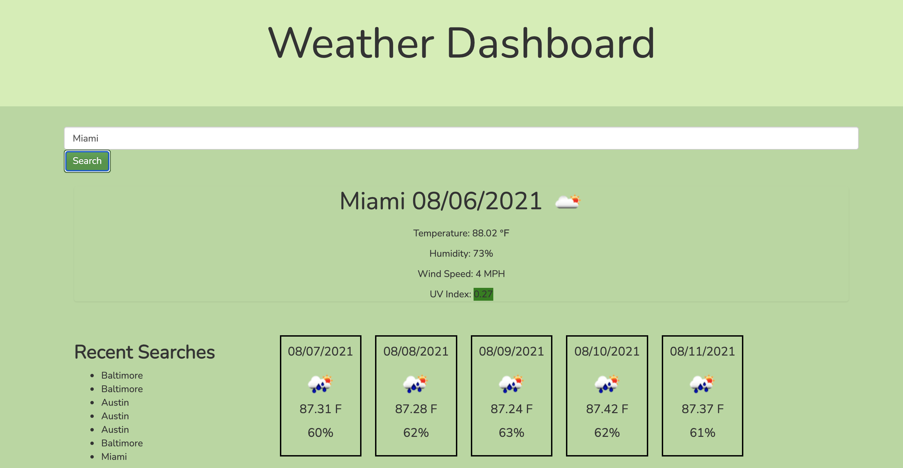
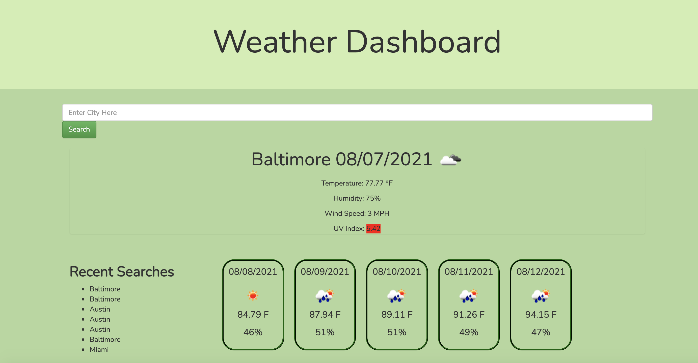

# Weather Dashboard
### Table of Contents
- [Description](#Description)
- [Technologies Used](#Technologies-Used)
- [Screenshots](#screenshots)
- [Sources](#sources)

## Description
Enter a city and see the weather for the next 5 days. Search another city and watch the previous cities in the recent searches section. 

## Technologies Used
```
HTML JavaScript JQuery

CSS Bootstrap 

Moment.js 
OpenWeather API 
Google Fonts
```

## How to Use
This application is simple to use. Pick a USA city and type it in. Click the search button. You will see the city, date, temperature in Fahrenheit, humidity, wind speed, and UV Index. You will also see the next 5 days of the city. After you search, the search will appear in the recent searches section on the left side of the screen. You can click the city and the next five days will show up.

## Screenshots
This is the initial screen that has the search bar and any recent searches.


This is the screen that appears after a new city is searched with the date and the temperature, humidity, wind speed, and UV Index.


This is the screen with the view of a previous search. This image shows the new styling.


## Sources
Created and designed by me. Click [whatawhat](www.github.com/whatawhat) to visit my repository.

